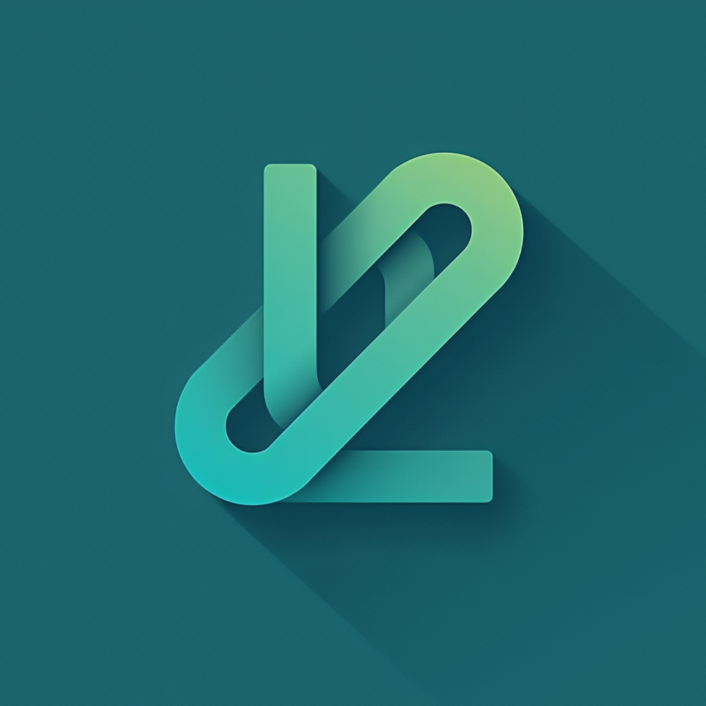

# Lynkus

Lynkus is a social media platform developed as the graduation project for the Digital Egypt Pioneers Initiative (DEPI) internship program. Our mission is to create unique and meaningful connections between people.

## Table of Contents

- [Features](#features)
- [Tech Stack](#tech-stack)
- [Live Demo](#live-demo)
- [API Documentation](#api-documentation)
- [Contributing](#contributing)
- [Team](#team)
- [License](#license)
- [Acknowledgments](#acknowledgments)

## Features

### Core Features

- User Authentication (JWT)
- Dark/Light Mode Toggle
- Post Management (CRUD)
- User Profiles
- Notifications
- Search Functionality (Posts and Users)

## Tech Stack

- **Frontend**:
  - **_React (with Vite)_**: For fast build and development experience.
  - **_JavaScript_**: Primary language for frontend logic.
  - **_Tailwind CSS_**: For quick and efficient styling.
  - **_Flowbite React_**: Pre-designed components for faster UI development.
  - **_Axios_**: For handling HTTP requests to the backend API.
  - **_Redux_**: For managing global application state, especially for user authentication, posts, and notifications.
- **Backend**:
  - **_Node.js_**: Server-side runtime for handling requests.
  - **_Express.js_**: Web framework for building the REST API.
  - **_JavaScript_**: For backend logic.
- **Database**:
  - _**MongoDB**_: NoSQL database for flexible data storage.
  - _**Mongoose**_: ODM library to interact with MongoDB.
- **Authentication**:
  - _**JWT (JSON Web Tokens)**_: For secure and stateless user authentication
- **Development Tools**:
  - _**VS Code**_: Code editor for efficient development.
- **Project Management**:
  - _**Jira**_: For task tracking, bug management, and agile project management.
- **Version Control**:
  - _**GitHub**_: For collaboration and version control.

## Live Demo

Experience Lynkus in action! Visit our live demo at [https://www.lynkus.com](https://www.lynkus.com) (replace with your actual live URL once deployed).

## API Documentation

For detailed API documentation, please refer to our [Swagger Documentation](https://lynkus-3.onrender.com/api-docs/).

## Team

- [Abdelrahman Sameh (Me)](https://github.com/abdoSamehDev)
- [Ahmed Fawzy](https://github.com/Ahmad22456)
- [Abdelrahman Zain](https://github.com/zainmo11)
- [Ziad El-Sayed](https://github.com/ZiadElsayed01)
- [Basil Mosalam](https://github.com/Bailts110)

## Acknowledgments

- We would like to express our sincere gratitude to the Digital Egypt Pioneers Initiative (DEPI) for providing this invaluable opportunity to learn and grow as developers.
- A special thank you to our instructor, **[Eng. Ahmed](https://github.com/Ahm3dMoham3d)**, for his valuable guidance and support throughout our learning journey in the initiative.
